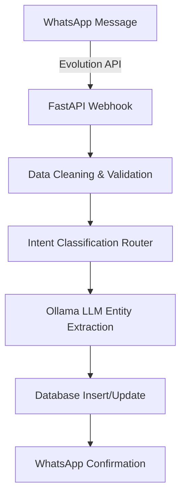

# Data Pipelines Architecture

## Overview
The Digital Store Manager (KiranaAI) processes real-time, unstructured data from simple WhatsApp messages into structured database records using a streamlined data pipeline.

## 1. Ingestion Layer
**Source:** WhatsApp Business API (via Evolution API Webhooks)
- The pipeline starts when a store owner texts the designated WhatsApp number.
- **Webhook Endpoint:** `POST /api/v1/whatsapp/webhook`
- **Data Format:** Unstructured text (`"I sold 5 packs of maggi"`).

## 2. Transformation Layer
**Service:** `backend/app/ml/data_pipelines/` (Previously part of services)
- **Cleaning:** Strips out emojis, excessive whitespace, and non-alphanumeric noise if unnecessary.
- **Intent Routing:** The text is passed to an early-stage SLM (Small Language Model) router or rule-based parser to classify the intent (`INVENTORY_UPDATE`, `KHATA_ENTRY`, `QUERY`).

## 3. Inference / Entity Extraction Layer
**Service:** `backend/app/ml/inference/ai_service.py`
- Once intent is verified, the clean text is injected into a strict system prompt.
- **Extraction:** The LLM (Ollama) extracts structured entities (e.g., `{"item": "maggi", "quantity": 5, "action": "subtract"}`).

## 4. Storage & Persistence
**Destination:** PostgreSQL (via Supabase / SQLModel)
- **Validation:** Extracted entities are mapped against Pydantic schemas.
- **Upsert:** Data is written to the `Inventory` or `Khata` tables.
- **Feedback Loop:** A confirmation message is fired back to the ingestion layer (Evolution API -> WhatsApp) to confirm the transaction.

## Diagram

